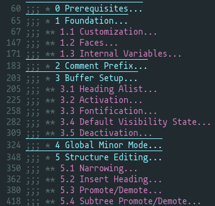

#+TITLE: outline-stars
#+AUTHOR: Paul H. McClelland
#+OPTIONS: toc:nil num:nil

*Org-style star headings for outline-minor-mode*

~outline-stars~ brings ~org~-like section folding to non-~org~ buffers using star-based comment headings (~;;; *~, ~### *~, ~// *~, /etc./) and the built-in ~outline-minor-mode~.  It handles comment prefix detection, per-level fontification, ~imenu~ integration, and star-aware structure editing in a single, dependency-free file.

* Design and Scope

The [[https://github.com/alphapapa/outshine][outshine]] package introduced the idea of using comment-prefixed star headings to bring ~org~-style folding and navigation to source code buffers.  Continuing in this spirit, ~outline-stars~ provides similar navigation features but in a more stable and lightweight manner, building on the improvements that ~outline-minor-mode~ has received since Emacs 28 (visibility cycling, heading fontification, margin buttons, /etc./).

Where ~outshine~ carried a full ~org~-emulation layer with dependencies on ~outorg~ and ~cl~, ~outline-stars~ limits itself to what the built-in ~outline~ system cannot do on its own: deriving headings from comment syntax, fontifying heading text without coloring the comment prefix, providing star-aware promote/demote, and working around the ~outline-search-function~ issue introduced in Emacs 29.  Everything else—cycling, folding, subtree movement—is delegated to ~outline-minor-mode~ directly.

By default, headings use section-level comment prefixes (/e.g./, ~;;; *~ in elisp) where the language supports it.  These degrade gracefully in vanilla Emacs: a file with ~;;; *~ headings is foldable out of the box, since ~lisp-outline-search~ already recognizes ~;;;~ as a section heading.  For languages with multi-character comment starters (~//~ in C, C++, Java), the prefix is left unchanged to avoid conflicts with documentation comment syntax like Doxygen.

* Features

~outline-stars~ extends Emacs's built-in ~outline-mode~ with additional functionality.  Enhancements include:

- *Comment-aware heading detection* — derives the heading prefix from ~comment-start~ and ~comment-add~; works across elisp, R, Python, shell, C, and any other mode with a comment convention
- *Per-level fontification* — applies ~outline-stars-level-N~ faces to heading text only, leaving the comment prefix and stars in their original face
- *Optional heading overline* — adds an overline to heading lines; configurable via ~outline-stars-overline~ (~nil~, ~level-1~, or ~t~ for all levels)
- *Automatic TAB cycling* — enables ~outline-minor-mode-cycle~ so =TAB= on a heading cycles visibility with no manual configuration
- *Startup visibility state* — configurable initial folding via ~outline-stars-default-state~: ~folded~ (top-level only), ~content~ (all headings, body hidden), or ~show-all~; overridable per-mode via ~outline-stars-default-state-alist~ or per-file via file-local variables
- *Imenu integration* — exposes star headings as navigable ~imenu~ entries alongside any existing mode entries
- *Star-aware promote/demote* — single-heading and whole-subtree variants, with configurable default behavior via ~outline-stars-promote-subtree-p~
- *Global visibility cycling* — cycles through folded, content, and show all from any point in the buffer
- *Sibling sorting* — alphabetically sort headings at the same level, carrying their subtrees
- *Section numbering* — insert or update hierarchical section numbers with configurable start index (0 or 1), auto-numbering on heading insertion, and scoped numbering (whole buffer, subtree, or region)

* Installation

~outline-stars~ is not yet available in any Emacs package repository.

** With ~elpaca~ or ~straight~

Install directly from the online repository:

#+BEGIN_SRC emacs-lisp
(use-package outline-stars
  :ensure (:host codeberg :repo "phmcc/outline-stars")
  :config (outline-stars-mode 1))
#+END_SRC

** With ~package-vc~

#+BEGIN_SRC emacs-lisp
(use-package outline-stars
  :vc (outline-stars :url "https://codeberg.org/phmcc/outline-stars")
  :config (outline-stars-mode 1))
#+END_SRC

** Manual

Clone the repository and add it to the load path:

#+BEGIN_SRC emacs-lisp
(add-to-list 'load-path "~/path/to/outline-stars")
(require 'outline-stars)
(outline-stars-mode 1)
#+END_SRC

* Quick Start

** 1. Enable the global minor mode

#+BEGIN_SRC emacs-lisp
(outline-stars-mode 1)
#+END_SRC

This activates star-based headings for all modes listed in ~outline-stars-modes~ (defaults to ~prog-mode~).

** 2. Add additional modes if needed

#+BEGIN_SRC emacs-lisp
(setq outline-stars-modes '(prog-mode LaTeX-mode ledger-mode))
#+END_SRC

** 3. Use headings in your files

Headings are comment lines followed by stars indicating depth:

#+BEGIN_EXAMPLE
;;; * Top-level section
;;; ** Subsection
;;; *** Sub-subsection
#+END_EXAMPLE

Standard ~outline-minor-mode~ keybindings work immediately: ~TAB~ on a heading to cycle visibility, ~C-c @ C-t~ to fold all, /etc./

* Heading Convention

By default, headings use section-level comments for modes with single-character comment starters:

| Mode           | Level 1 | Level 2 | Level 3 |
|----------------+---------+---------+---------|
| Emacs Lisp     | ~;;; *~   | ~;;; **~  | ~;;; ***~ |
| R / Python     | ~### *~   | ~### **~  | ~### ***~ |
| Shell          | ~## *~    | ~## **~   | ~## ***~  |
| C / C++ / Java | ~// *~    | ~// **~   | ~// ***~  |

Multi-character comment starters like ~//~ are never extended, avoiding conflicts with Doxygen and similar documentation comment syntax.

** Classic outshine convention

Set ~outline-stars-section-comments~ to nil for the original ~outshine~ convention:

#+BEGIN_SRC emacs-lisp
(setq outline-stars-section-comments nil)
#+END_SRC

| Mode           | Level 1 | Level 2 | Level 3 |
|----------------+---------+---------+---------|
| Emacs Lisp     | ~;; *~    | ~;; **~   | ~;; ***~  |
| R / Python     | ~## *~    | ~## **~   | ~## ***~  |
| Shell          | ~# *~     | ~# **~    | ~# ***~   |
| C / C++ / Java | ~// *~    | ~// **~   | ~// ***~  |

* Commands

| Command                         | Description                                          |
|---------------------------------+------------------------------------------------------|
| ~outline-stars-insert-heading~    | Insert a heading at the current level                |
| ~outline-stars-promote~           | Promote heading (or subtree, see customization)      |
| ~outline-stars-demote~            | Demote heading (or subtree, see customization)       |
| ~outline-stars-promote-subtree~   | Always promote heading and all children by one level |
| ~outline-stars-demote-subtree~    | Always demote heading and all children by one level  |
| ~outline-stars-narrow-to-subtree~ | Narrow buffer to the current subtree                 |
| ~outline-stars-cycle-buffer~      | Cycle visibility: folded → content → show all        |
| ~outline-stars-sort-siblings~     | Alphabetically sort sibling headings with subtrees   |
| ~outline-stars-number-headings~   | Insert or update section numbers in the whole buffer  |
| ~outline-stars-number-subtree~    | Number headings within the current parent's subtree  |
| ~outline-stars-number-region~     | Number headings within the active region             |
| ~outline-stars-strip-numbers~     | Remove section numbers from all headings             |

All standard ~outline-minor-mode~ commands (~outline-cycle~, ~outline-hide-sublevels~, ~outline-move-subtree-up~, /etc./) work as expected with star headings.

* Faces

Heading text is fontified with ~outline-stars-level-1~ through ~outline-stars-level-8~.  These inherit from the built-in ~outline-1~ through ~outline-8~ faces by default.

To customize per-mode:

#+begin_src emacs-lisp
(defun my/ess-outline-faces ()
  (face-remap-add-relative 'outline-stars-level-1 '(:foreground "#70BCFF"))
  (face-remap-add-relative 'outline-stars-level-2 '(:foreground "#9D75DB")))
(add-hook 'ess-mode-hook #'my/ess-outline-faces)
#+end_src

* Customization

| Variable                          | Default     | Description                                           |
|-----------------------------------+-------------+-------------------------------------------------------|
| ~outline-stars-modes~               | ~(prog-mode)~ | Parent modes where stars activate                     |
| ~outline-stars-max-level~           | ~8~           | Maximum heading depth                                 |
| ~outline-stars-promote-subtree-p~   | ~t~           | Whether promote/demote operates on the full subtree   |
| ~outline-stars-section-comments~    | ~t~           | Use section-level comments (~;;;~, ~###~) as prefix       |
| ~outline-stars-overline~            | ~nil~         | Heading overline: ~nil~, ~level-1~, or ~t~ (all levels)      |
| ~outline-stars-default-state~       | ~nil~         | Startup visibility: ~folded~, ~content~, ~show-all~, or ~nil~ |
| ~outline-stars-default-state-alist~ | ~nil~         | Per-mode overrides for ~outline-stars-default-state~    |
| ~outline-stars-number-start~        | ~1~           | Starting number for section numbering (0 or 1)        |
| ~outline-stars-auto-number~         | ~t~           | Auto-number on insert, renumber on promote/demote     |

* Technical Details

** File structure

| File             | Description                                                            |
|------------------+------------------------------------------------------------------------|
| ~outline-stars.el~ | Core: heading detection, fontification, structure editing, global mode |

** Requirements

- Emacs 29.1+ (for ~outline-minor-mode~ improvements and ~outline-search-function~)
- No external dependencies

** Implementation notes

~outline-stars~ runs on ~after-change-major-mode-hook~ rather than individual mode hooks.  This ensures its ~outline-regexp~ overrides any mode-specific defaults—notably ESS, which sets ~outline-regexp~ to an unmatchable pattern on its own hooks.

On Emacs 29+, several major modes set ~outline-search-function~, which outline commands check /before/ ~outline-regexp~.  When non-nil, ~outline-regexp~ is silently ignored regardless of its value.  ~outline-stars~ nullifies this variable buffer-locally so that its custom regexp is consulted.

Heading level resolution uses a pre-seeded ~outline-heading-alist~ for fast lookup.  Rather than running a regexp match and counting stars on every ~outline-level~ call, the alist maps each heading string directly to its level number, with a fallback to star counting for robustness.

Default visibility state is applied immediately at the end of setup (for non-file buffers) and again on ~hack-local-variables-hook~ (for file-visiting buffers).  This ensures file-local variable overrides (~outline-stars-default-state: folded~) take effect, since ~hack-local-variables~ runs after ~after-change-major-mode-hook~.

* Related Packages

Several other packages address code folding and outline navigation in Emacs.  ~outline-stars~ specializes in zero-config extensions to ~outline-minor-mode~.  However, these alternatives may better suit different workflows:

- [[https://github.com/jdtsmith/outli][outli]] — similar goals with richer visual styling (blended backgrounds, overlines on all levels) and per-mode configurability via a stem/repeat-char alist; a good choice for users who want fine-grained control over heading appearance
- [[https://github.com/alphapapa/outshine][outshine]] — the original star-heading package that inspired this work; provides a full ~org~-emulation layer with speed commands, ~outorg~ integration, and LaTeX support
- [[https://github.com/jamescherti/kirigami.el][kirigami]] — a unified fold/unfold dispatcher that routes to whichever folding backend is active (~outline~, ~hs-minor-mode~, ~treesit-fold~, ~origami~, /etc./); complementary to ~outline-stars~ rather than a replacement
- [[https://github.com/jdtsmith/outline-indent][outline-indent]] — indentation-based folding for Python, YAML, and similar languages where structure is determined by whitespace rather than explicit markers

* Contributing

Contributions are welcome.  Please open an issue to discuss major changes, follow existing code style, and update documentation as appropriate.

* License

GPL-3.0-or-later
